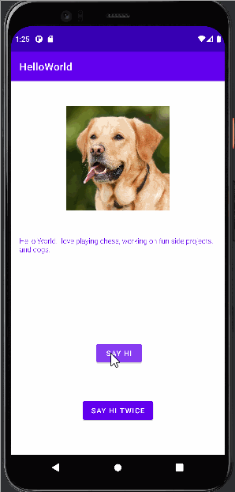

# AppPreWork
Contains prework files for Codepath's android programming program
# Android Prework - Click to Display App

Submitted by: Mikias Abeje

**Name of your app** is an android app that shows an image and introductory message, and allows pressing a button to display a Toast. 

Time spent: 4 hours spent in total

## Required Features

The following **required** functionality is completed:

* [x] Image and introductory message displayed on screen
* [x] Button displayed on screen
* [x] Toast with message appears when button is pressed 

The following **optional** features are implemented:

* [x] Included Another Button that does the same thing twice

## Video Walkthrough

Here's a walkthrough of implemented features:

<!-- Replace this with whatever GIF tool you used! -->
GIF created with [LiceCap](http://www.cockos.com/licecap/).  
<!-- Other options include:
[Kap](https://getkap.co/) for macOS
[ScreenToGif](https://www.screentogif.com/) for Windows
[peek](https://github.com/phw/peek) for Linux. -->

## Notes

Describe any challenges encountered while building the app:
*Encountered problems with the button.setOnClickListener section as I initially stuck with the 
default button.setOnClickListener() instead of the intended button.setOnClickListener{}, which had me 
creating a separate private class which still was'nt running. Took me about 20 minutes to figure out 
the problem here.
* I got the error message "initial commit failed android studio. cannot read..." when initially 
trying to commit the file onto github. I was able to get that section sorted out by following 
the tutorial on this page "https://blog.krybot.com/a?ID=00550-ed7d47ea-3066-4792-990b-43345d3669ff"
I tried to upload this link onto this just in case it does not exist by the time you are viewing this:
"https://web.archive.org/web/20220817224434/https://blog.krybot.com/a?ID=00550-ed7d47ea-3066-4792-990b-43345d3669ff"

## License

    Copyright [2022] [Mikias Abeje]

    Licensed under the Apache License, Version 2.0 (the "License");
    you may not use this file except in compliance with the License.
    You may obtain a copy of the License at

        http://www.apache.org/licenses/LICENSE-2.0

    Unless required by applicable law or agreed to in writing, software
    distributed under the License is distributed on an "AS IS" BASIS,
    WITHOUT WARRANTIES OR CONDITIONS OF ANY KIND, either express or implied.
    See the License for the specific language governing permissions and
    limitations under the License.
